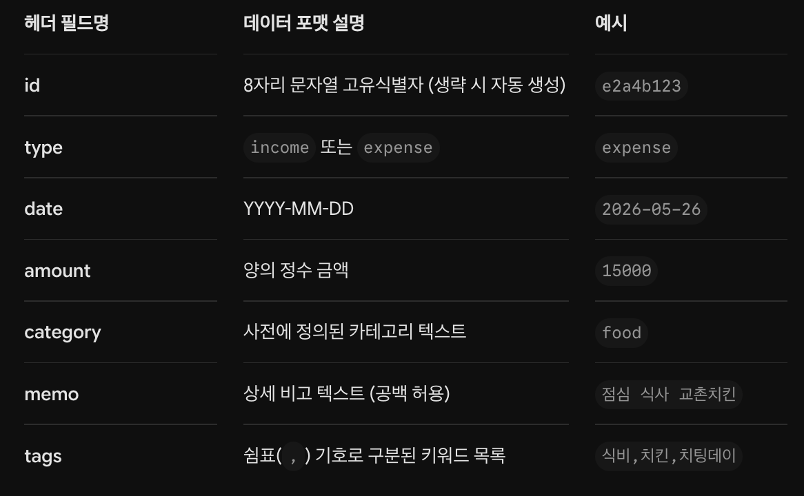

# 💰 CLI 대화형 가계부 App (budget_app)

이 애플리케이션은 사용자의 수입/지출을 터미널 환경에서 효율적으로 기록하고 추적할 수 있는 CLI 도구입니다.

## 🚀 1. 실행 방법
파이썬 3.7+ 환경에서 설치 없이 패키지 모듈 형태로 바로 실행 가능합니다.

```bash
# 기본 실행 및 도움말 확인
python3 -m budget_app --help

# 하위 명령어 상세 도움말 확인 예시
python3 -m budget_app search --help
```
## 📂 2. 저장 파일 위치 및 형식
모든 데이터는 별도의 데이터베이스 없이 ./data/ 디렉터리 내에 JSONL(JSON Lines) 텍스트 포맷으로 영구 분리 저장됩니다.

거래 내역: ./data/transactions.jsonl

카테고리: ./data/categories.jsonl

월별 예산: ./data/budgets.jsonl

💡 --data-dir <경로> 옵션을 통해 데이터 보관 위치를 임의로 변경할 수 있습니다.
예시: python -m budget_app --data-dir ./my_pocket list

## ⌨️ 3. 주요 명령 사용 예시
거래 추가 (대화형)
```bash
python3 -m budget_app add
```
거래 목록 조회 (최신순 5개 제한)
```bash
python3 -m budget_app list --limit 5
```
거래 조건 검색
```bash
python3 -m budget_app search --type expense --category food
```
월 요약 및 예산 연동
```bash
# 예산 먼저 설정
python3 -m budget_app budget set --month 2026-06 --amount 500000

# 월 요약 출력 (예산 대비 사용량 자동 표기)
python3 -m budget_app summary --month 2026-06 --top 5
```
카테고리 관리
```bash
python3 -m budget_app category list
python3 -m budget_app category add shopping
python3 -m budget_app category remove shopping
```
수정 및 삭제
```bash
python3 -m budget_app update --id a1b2c3d4
python3 -m budget_app delete --id a1b2c3d4
```

## 📋 4. Import / Export CSV 스키마
가져오기 및 내보내기 시 적용되는 CSV 헤더 스키마 양식은 다은과 같습니다.

```bash
# CSV 데이터 가져오기
python3 -m budget_app import --from ./test_data.csv

# 특정 월 데이터 CSV 파일로 백업 내보내기
python3 -m budget_app export --out ./backup_05.csv --month 2026-05
```
